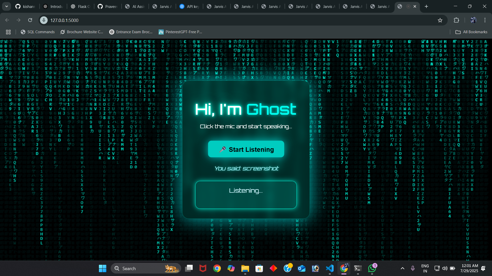

Here’s a professional `README.md` file for your **Ghost AI Voice Assistant** project. It includes a project overview, features, setup instructions, and credits:

---

````markdown
# 👻 Ghost - AI Voice Assistant

**Ghost** is a Matrix-inspired voice assistant built using Flask, JavaScript, and Web Speech API. It listens to voice commands and responds intelligently with jokes, time, Wikipedia facts, and more — all wrapped in a cyberpunk-themed interface.



---

## 🧠 Features

- 🎤 Voice recognition and response using Web Speech API
- 🧾 Real-time spoken text display
- 😂 Random joke generation
- 📆 Tells current time and date
- 📚 Wikipedia summaries
- 🎵 Music control (with browser playback)
- 🖼️ Matrix rain background animation (HTML5 canvas)
- 🧑‍💻 Built with Flask + JavaScript

---

## 🚀 Getting Started

### 1. Clone the repository

```bash
git clone https://github.com/your-username/ghost-voice-assistant.git
cd ghost-voice-assistant
````

### 2. Install Python dependencies

```bash
pip install flask wikipedia
```

### 3. Run the Flask server

```bash
python app.py
```

Visit `http://localhost:5000` in your browser.

---

## 🗣️ Example Commands

* “What’s the time?”
* “Tell me a joke”
* “Who is Elon Musk?”
* “Play music”
* “Stop music”

---

## 🖼️ UI Preview


---

## 🛠 Tech Stack

* **Frontend**: HTML5, CSS3, JavaScript (Web Speech API)
* **Backend**: Python Flask
* **APIs**: Wikipedia API

---

## 📁 Project Structure

```
ghost-voice-assistant/
├── static/
│   └── style.css
├── templates/
│   └── index.html
├── app.py
└── README.md
```

---

## 🙏 Credits

* Matrix rain effect: Custom Canvas JS
* Fonts: Orbitron via Google Fonts
* Voice: Web Speech API (built into Chrome)

---

## 📜 License

This project is open source.

```
```
